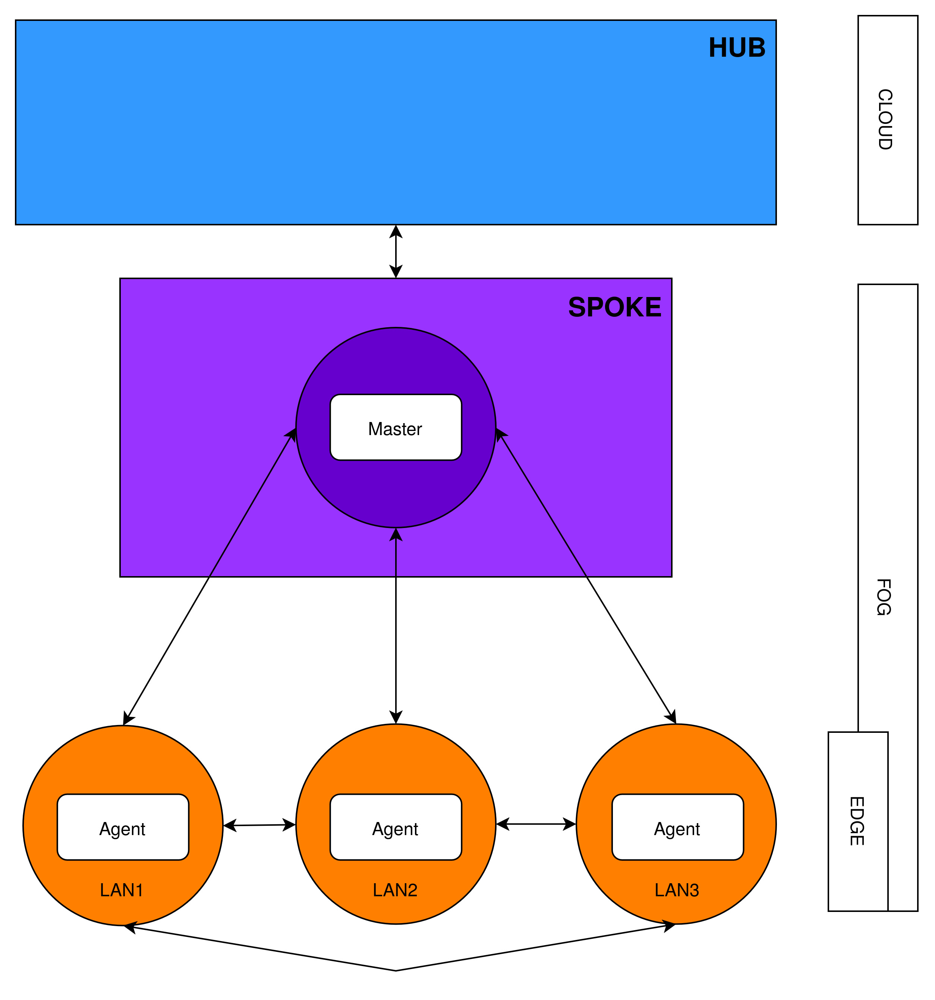
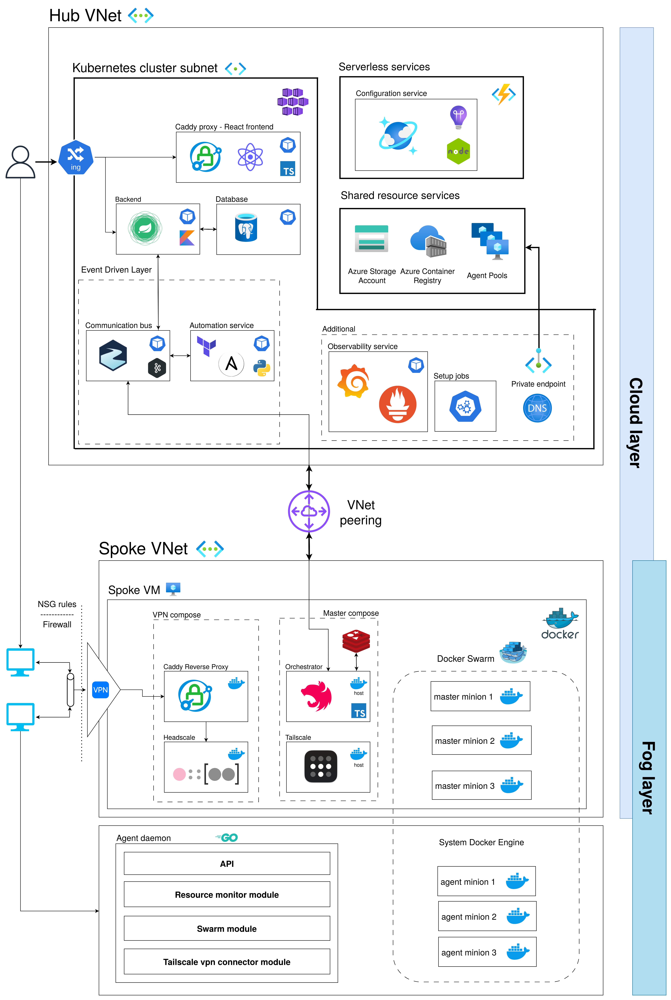

# Design and Implementation of a Reliable System for Remote Management of Network Agents and Resources in a Distributed VPN Environment

This is the central repository for our engineering thesis (bachelor's thesis) completed at the **Poznań University of Technology** (Politechnika Poznańska) at the **Faculty of Computing and Telecommunications** (Wydział Informatyki i Telekomunikacji).

This repository serves as the main landing page and entry point for the entire project. It contains the core system documentation, architectural overviews, and links to the individual repositories hosting each service, component, configuration file and deployment scripts.

### Authors

- [Anna Gąsiorowska](https://github.com/Aeri4a)
- [Stanisław Mazik](https://github.com/smazik02)
- [Michał Olejniczak](https://github.com/m-olej)

### Supervised by:

dr hab. inż. Anna Kobusińska, prof. PP

## Thesis scope and description

This thesis addresses the growing complexity of infrastructure management within the evolving Cloud-Fog-Edge continuum. As modern distributed computing shifts away from traditional, centralized cloud architectures, hierarchical management strategies struggle to efficiently coordinate resource-constrained edge devices and core cloud servers. To overcome these limitations, this research focuses on the design and implementation of a hybrid network manager and orchestration layer that dynamically provisions network layers without creating data bottlenecks. The primary objective is to abstract underlying technical complexities, allowing diverse, distributed agents to be unified into a single, secure system that seamlessly shares resources between public cloud infrastructures and private local networks.

The scope of the project centers on the establishment of a distributed Virtual Private Network (VPN) capable of facilitating direct, peer-to-peer communication between endpoints, completely bypassing standard network address translation (NAT) constraints regardless of physical location. By serving solely as a lightweight coordination mechanism rather than a data bottleneck, the system enables reliable, direct inter-device connectivity. Ultimately, the proposed platform bridges the gap between static cloud services and dynamic local edge devices, effectively aggregating accessible resources and computational power into a unified, secure, and distributed computational cluster.

## Services and repositories

| Service / Component       | Repository Link                                                                         | Description                                                                                                                                                                                                                                                                                                             |
| :------------------------ | :-------------------------------------------------------------------------------------- | :---------------------------------------------------------------------------------------------------------------------------------------------------------------------------------------------------------------------------------------------------------------------------------------------------------------------- |
| **Frontend**              | [Bazant-Inc/frontend](https://github.com/Bazant-Inc/frontend)                           | User interface for identity management, Workspace administration, and Agent registration. Implemented as a Single Page Application (SPA) in React and TypeScript, served via a Caddy reverse proxy. Communicates using REST APIs and Server-Sent Events (SSE).                                                          |
| **Backend**               | [Bazant-Inc/backend](https://github.com/Bazant-Inc/backend)                             | Central control unit executing business logic, enforcing resource-level authorization, and handling user session management. Written in Kotlin using the Spring Boot framework. Interfaces with a PostgreSQL database and publishes infrastructure change events to Apache Kafka.                                       |
| **Configuration Service** | [Bazant-Inc/configuration-service](https://github.com/Bazant-Inc/configuration-service) | Storage and retrieval service for dynamic Workspace configurations. Written in TypeScript using the Azure Functions SDK. Exposes a REST API to interface with a serverless Azure Cosmos DB NoSQL database.                                                                                                              |
| **Automation Service**    | [Bazant-Inc/automation-service](https://github.com/Bazant-Inc/automation-service)       | Infrastructure management engine that consumes change requests from a Kafka topic. Written in Python utilizing the `asyncio` event loop and ASGI. Executes Terraform CLI commands as asynchronous subprocesses and embeds Ansible as a native library.                                                                  |
| **Orchestrator**          | [Bazant-Inc/orchestrator](https://github.com/Bazant-Inc/orchestrator)                   | Node coordination and cluster management service running on the Workspace Master VM. Written in JavaScript/TypeScript using the Nest.JS framework. Communicates with edge nodes via a REST API, tracks metadata using Redis, and provisions Docker Swarm clusters.                                                      |
| **Agent**                 | [Bazant-Inc/agent](https://github.com/Bazant-Inc/agent)                                 | Device management application running as a systemd daemon on end-user machines. Written in Golang and compiled as a static binary. Exposes a RESTful API for Orchestrator management, embeds a Tailscale client for VPN tunneling, and handles local Docker Swarm cluster integration.                                  |
| **Ansible**               | [Bazant-Inc/ansible](https://github.com/Bazant-Inc/ansible)                             | Automation playbooks used to configure clean Linux virtual machines into Workspace Master nodes. Written in YAML and executed by Python. Installs system packages, configures Headscale VPN control planes, and deploys application stacks via Docker Compose.                                                          |
| **Observability**         | [Bazant-Inc/observability](https://github.com/Bazant-Inc/observability)                 | Telemetry collection and visualization platform for monitoring cluster metrics and application success rates. Composed of a Prometheus time-series database operating on a pull model and Grafana for dashboard rendering. Scrapes data from Kubernetes pods and core backend services.                                 |
| **Hub Deployment**        | [Bazant-Inc/hub-deployment](https://github.com/Bazant-Inc/hub-deployment)               | Infrastructure-as-Code scripts to provision and deploy the entire central Hub cluster. Written using Terraform configuration files, Kubernetes manifests, and Bash orchestration scripts. Deploys services to Azure, configuring Azure Kubernetes Service (AKS), Private Endpoints, and Azure Files persistent storage. |

### High-Level Diagram

Based on the system's high-level architectural design, the platform is structured around a hierarchical **Hub-and-Spoke** topology organized across the **Cloud-Fog-Edge continuum**. At the highest layer, a centralized cloud **Hub** houses the core management, database, and automation service spaces. The Hub functions as the primary user entry point for global monitoring and coordinates state synchronization across the entire infrastructure. It dynamically provisions isolated network fragments down to the layers below without directly handling or mediating the network traffic generated by lower-tier end devices.

Directly beneath the Hub in the architecture are the **Spokes**, which structurally materializes the **Fog layer** as an isolated user **Workspace**. Each Spoke virtual machine contains a specialized **Master node**, which acts as an artificial VPN client and a cloud access bridge. The Master node’s primary responsibility is to attach to the VPN data plane, providing a secure, shared network entry point through which connected endpoints can securely communicate with cloud-native resources or other virtual networks via established peering.

At the bottom of the hierarchy sits the **Edge layer**, consisting of distributed **Agents** deployed across distinct local area networks (**LANs**). Operating on a **Zero Trust model**, these resource-constrained edge devices establish direct, encrypted peer-to-peer tunnels among themselves to form a mesh-based overlay network within their assigned Workspace. This design enforces a strict separation of planes: while the higher-tier Cloud and Fog layers handle lightweight control signaling and network discovery map distribution, the edge devices exchange data payloads directly, avoiding traffic bottlenecks and minimizing network latency.

### Service Diagram

The global system layout is implemented as a hierarchical network topology split across two main **Azure Virtual Networks (VNets)** connected via bidirectional **VNet Peering**. The upper section consists of the **Hub VNet**, which is partitioned into three functional subnets to isolate core responsibilities and secure **Platform-as-a-Service (PaaS)** resources. The primary computing space is the **AKS subnet**, which hosts the entire containerized application stack behind an **Ingress controller** serving as the external entry point for end users. This cluster connects internally to an event-driven communication layer and is flanked on the right by the **Agent pool subnet** for container image compilation and the **Private endpoint subnet**, which encapsulates shared databases, registries, and configuration services using **Azure Private Endpoints**.

The lower section of the diagram details the **Spoke VNet**, which serves as the user's isolated **Workspace** and communicates directly with the Hub via the peering connection. Inside the Spoke network, a single **Virtual Machine** running the **Docker engine** hosts two isolated container stacks. The first stack manages the **Headscale VPN control plane** behind a reverse proxy to route signaling traffic, while the adjacent **Master stack** executes the **Tailscale data plane** client and coordination tools backed by a **Redis** database cache. This virtual machine establishes a logical firewall gateway using **Network Security Group** rules to filter incoming connections from external networks.

At the bottom edge of the architecture sit the distributed physical endpoints operating behind various **private local area networks (LANs)**. Each target device runs the native **Agent daemon**, which is structurally layered into specialized connection, API, synchronization, and cluster modules. These edge modules interface directly with the local host network to establish encrypted **peer-to-peer tunnels** with the Spoke VM and alternative client nodes. This configuration spans across both the virtual machine and local device domains to dynamically construct a unified **Docker Swarm cluster**, where the cloud-based Spoke VM acts as the **manager node** and the remote edge devices serve as **worker nodes** executing distributed computing workloads.
