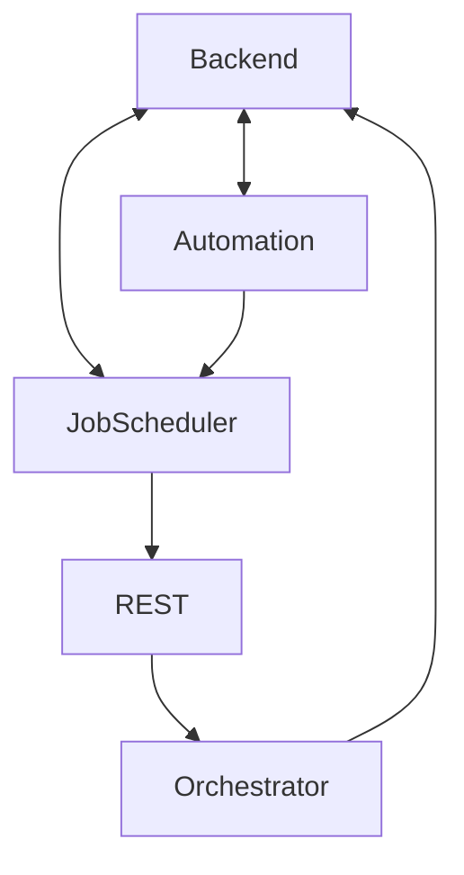

# Kafka

## Services using Kafka

-   Backend [B]
-   Automation service [A]
-   Job scheduler service [J]
-   Orchestrator [O]

## Services communication graph

## Data sent on topics between services

### Backend -> Automation

Manage workspace infra

### Automation -> Backend

Update infra needed for ui

### Automation -> Job scheduler

Info about workspace creation or deletion to start/stop healthchecks

### Backend -> Job scheduler

Initialize tasks

### Job scheduler -> Backend

Info about workspace/agents status from job scheduler healthchecks

### Orchestrator -> Backend

Tasks logs + notifying backend of the agent hostname
(When Automation Service starts the process of adding Agent to the workspace, it lefts info about transaction_id of said add action to Orchestrator, which it saves in Redis. When a corresponding Agent connects, Orchestrator sends a message to a topic, backend receives the message and updates agent's hostname)

### Job scheduler -> Orchestrator

Healthchecks (REST)

## Topics

-   INFRA_AUTOMATION
-   INFRA_AUTOMATION_RESPONSE
-   INFRA_AUTOMATION_LOGS
-   TASK_SCHEDULE
-   TASK_SCHEDULE_RESPONSE
-   WORKSPACE_HEALTH
-   WORKSPACE_LOGS
-   WORKSPACE_AGENT_INFO
