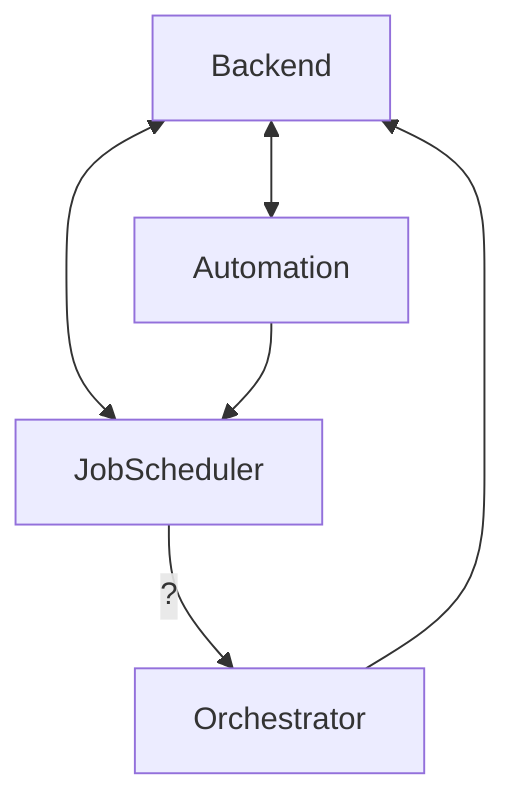

# Kafka

## Services using Kafka
- Backend [B]
- Automation service [A]
- Job scheduler service [J]
- Orchestrator [O]

## Services communication graph

## Data sent on topics between services

### Backend -> Automation
Manage workspace infra

### Automation -> Backend
Update infra needed for ui

### Automation -> Job scheduler
Info about workspace creation or deletion to start/stop healthchecks

### Backend -> Job scheduler
Initialize tasks

### Job scheduler -> Backend
Info about workspace/agents status from job scheduler healthchecks

### Orchestrator -> Backend
Tasks logs

### Job scheduler -> Orchestrator
Healthchecks

## Topics
